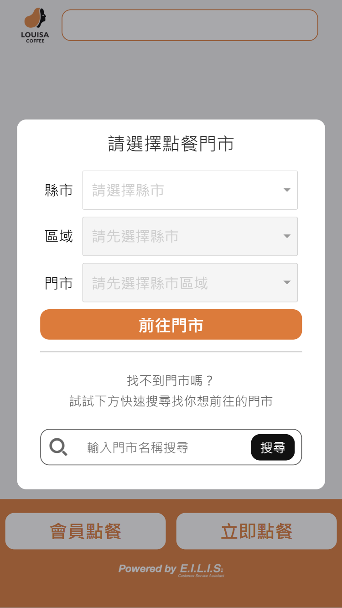
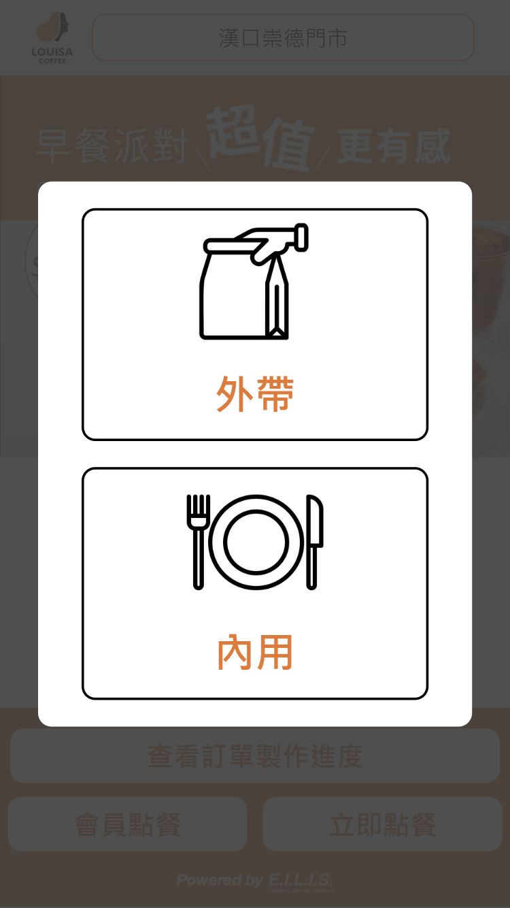
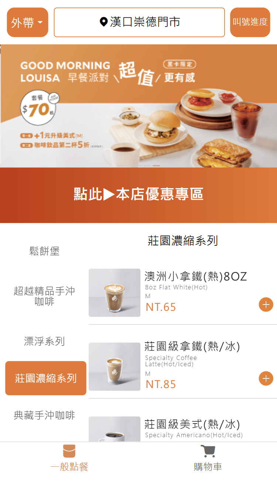
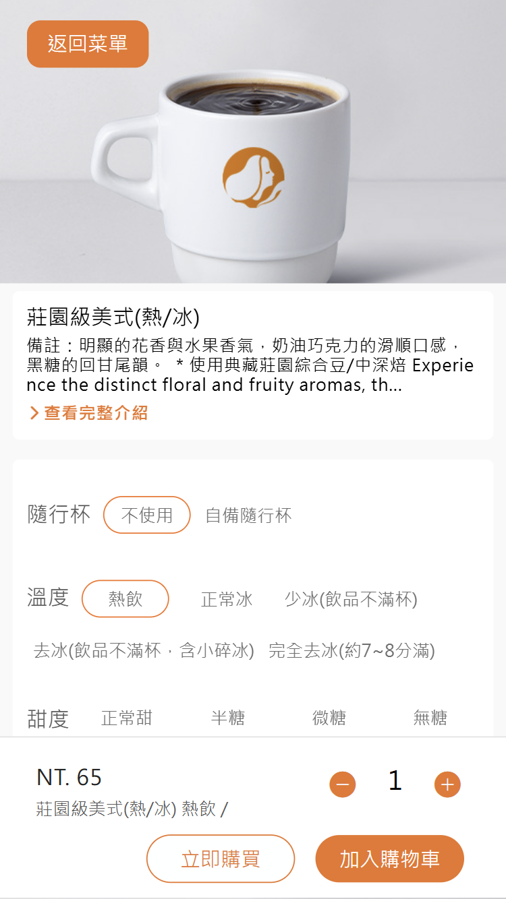
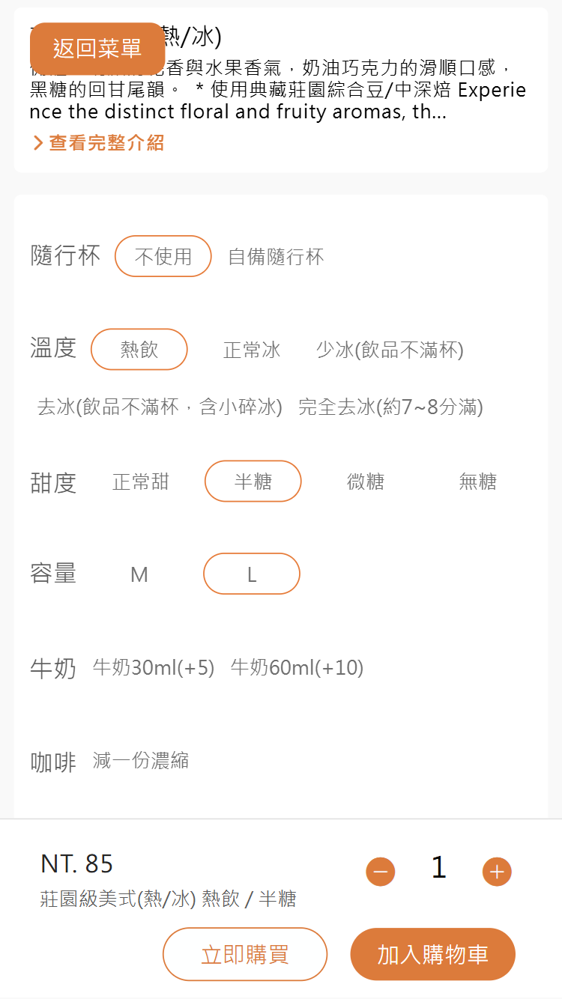
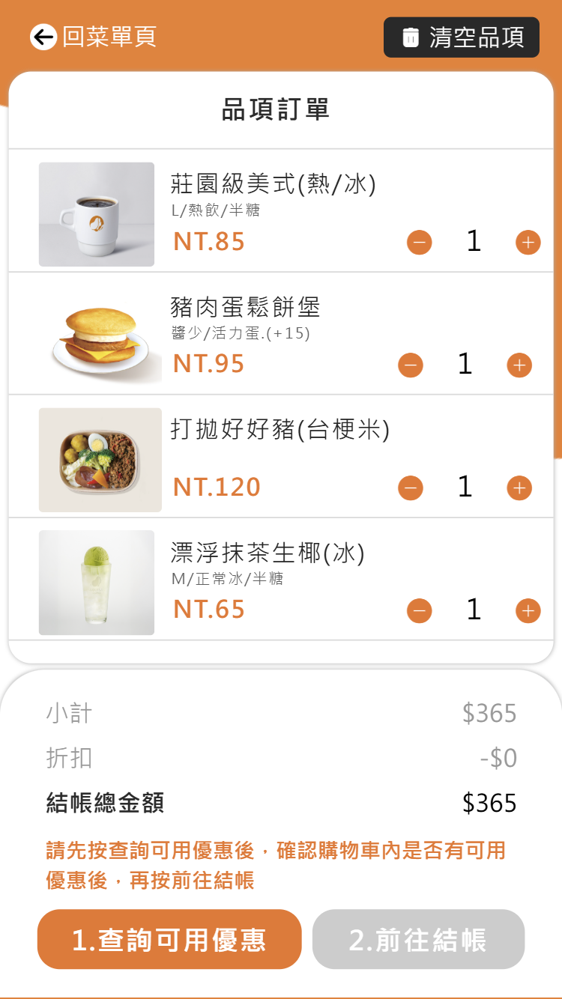
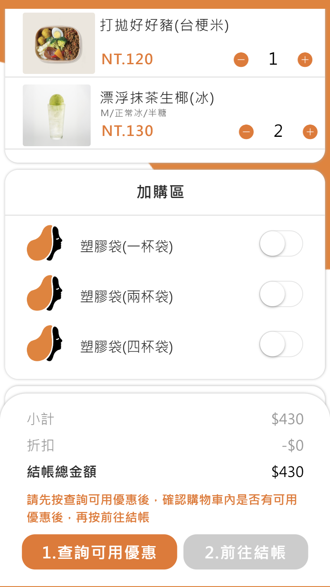
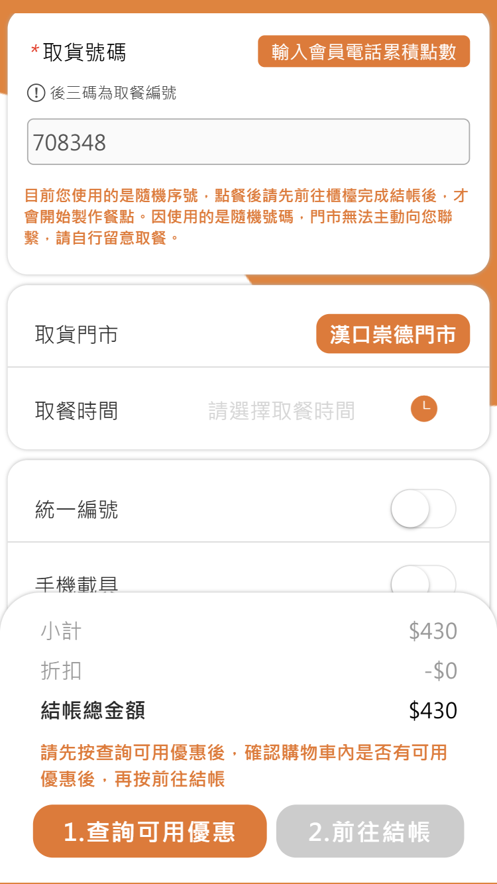

# 點餐系統流程分析
## 0. 選取：點餐門市

  - 主要流程：
    - 選擇：縣市/區域/門市
  - 重要欄位：
    - 縣市 city: 使用者選擇的縣市
    - 區域 district: 使用者選擇的行政區
    - 門市編號 storeId: 門市唯一識別碼
    - 門市名稱 storeName: 顯示給使用者的門市名稱
    - 門市狀態 storeStatus: [OPEN, BUSY, CLOSED]
    - 地址 address: 門市地址
    - 營業時間 businessHours: 營業起迄時間（如 10:00–22:00）
    - 可預約時段 pickupSlots: 可選取之取餐時段清單（可選）
## 1. 選取：外帶/內用

  - 主要流程：
    - 選取：外帶/內用
  - 重要欄位：
    - 用餐方式 serviceType: [TAKEOUT, DINE_IN]
    - 桌號 tableNumber: 內用時可填之桌號（可選）
    - 人數 partySize: 同行用餐人數（可選）
## 2. 菜單

  - 主要流程：
    - 選擇分類
    - 選擇該分類的商品：品名/價格/圖片
    - 加入購物車
  - 重要欄位：
    - 分類編號 categoryId: 菜單分類唯一識別碼
    - 分類名稱 categoryName: 菜單分類顯示名稱
    - 商品編號 productId: 商品唯一識別碼
    - 商品名稱 productName: 商品顯示名稱
    - 單價 unitPrice: 商品售價
    - 圖片網址 imageUrl: 商品圖片連結
## 3. 點餐：餐點介紹，選項

  - 主要流程：
    - 商品資訊：圖片/品名/簡介
    - 商品選項：類型/選項值(多樣)
    - 顯示價格、調整數量、加入購物車
  - 重要欄位：
    - 商品編號 productId: 當前選購之商品 ID
    - 商品名稱 productName: 當前選購之商品名稱
    - 商品簡介 description: 商品文字說明
    - 選項群組 optionGroupName: 如尺寸/甜度/冰塊/加料等
    - 是否必填 isRequired: [true, false]
    - 可選數量 selectionLimit: 單/多選上限
    - 選項值名稱 optionValueName: 某一選項的名稱（如 大杯/少冰）
    - 選項值代碼 optionValueId: 選項值唯一識別碼
    - 數量 quantity: 選購數量（預設 1）
    - 顯示價格 displayPrice: 依選項計算後的單價
## 4. 點餐：選項

  - 主要流程：
    - (承上頁，更多選項)
    - 商品選項：類型/選項值(多樣)
    - 顯示價格、調整數量、加入購物車
  - 重要欄位：
    - 客製備註 customNote: 使用者針對此商品的備註（可選）
## 5. 結帳：購物車

  - 主要流程：
    - 購物車品項列表：品名/規格選項/圖片/單價/數量(可調整)
    - 訂單彙總：小計/折扣/結帳總金額
  - 重要欄位：
    - 購物車編號 cartId: 當前購物車識別碼
    - 品項編號 itemId: 每個購物車品項識別碼
    - 商品名稱 productName: 品項商品名稱
    - 規格摘要 specSummary: 彙總客戶選項為一行字
    - 單價 unitPrice: 品項單價
    - 數量 quantity: 可調整數量
    - 小計 lineTotal: 單品項小計
    - 小計合計 subtotal: 全部品項小計
    - 折扣金額 discountTotal: 折扣彙總
    - 應付總金額 grandTotal: 結帳總金額
    - 優惠代碼 promoCode: 使用之優惠碼（可選）
## 6. 結帳：加購資訊

  - 主要流程：
    - 包裝材料選擇(非必填)
  - 重要欄位：
    - 包裝選擇 packagingOption: [NONE, CUTLERY, BAG_SMALL, BAG_MEDIUM, BAG_LARGE]
    - 包裝費用 packagingFee: 對應包裝之加收費用
    - 是否必填 isRequired: [true, false]
## 7. 結帳：取貨資訊

  - 主要流程：
    - 取貨號碼(自動產生)
    - 取貨資訊：取貨門市/取餐時間
    - 發票資訊：統一編號/手機載具
    - 備註
    - 送出確認
  - 重要欄位：
    - 取貨號碼 pickupNumber: 系統自動產生之取貨編號
    - 取貨門市 pickupStoreId: 取餐門市識別碼
    - 取餐時間 pickupAt: 預計取餐時間（ISO 8601）
    - 統一編號 taxId: 發票統編（可選）
    - 手機載具 mobileCarrier: 發票手機載具（可選）
    - 捐贈碼 donationCode: 發票捐贈碼（可選）
    - 備註 note: 訂單備註（可選）
    - 送出確認 confirmationStatus: [PENDING, CONFIRMED]
## 8. 結帳：進行付款
  - 主要流程：
    - 顯示總金額
    - 選取付款方式
    - 進行付款
  - 重要欄位：
    - 應付金額 payableAmount: 本次結帳應付總金額
    - 付款方式 paymentMethod: [CASH, CARD, E_WALLET]
    - 支付提供商 paymentProvider: 例如 ECPay | LinePay（可選）
    - 交易編號 transactionId: 金流或刷卡交易識別碼
    - 付款狀態 paymentStatus: [PENDING, AUTHORIZED, PAID, FAILED, REFUNDED]
    - 付款時間 paidAt: 完成付款時間（可選）
    - 退款時間 refundedAt: 若發生退款之時間（可選）
    - 發票號碼 invoiceNo: 若已開立之發票號碼（可選）
## 9. 取餐進度

  - 主要流程：
    - 取餐編號/進度回報
  - 重要欄位：
    - 訂單號碼 orderNumber: 訂單識別碼
    - 取餐編號 pickupNumber: 取餐識別碼
    - 訂單狀態 orderStatus: [RECEIVED, PREPARING, READY, PICKED_UP, CANCELLED]
    - 估計完成時間 eta: 預估可取餐時間
    - 最後更新時間 updatedAt: 狀態最後更新時間