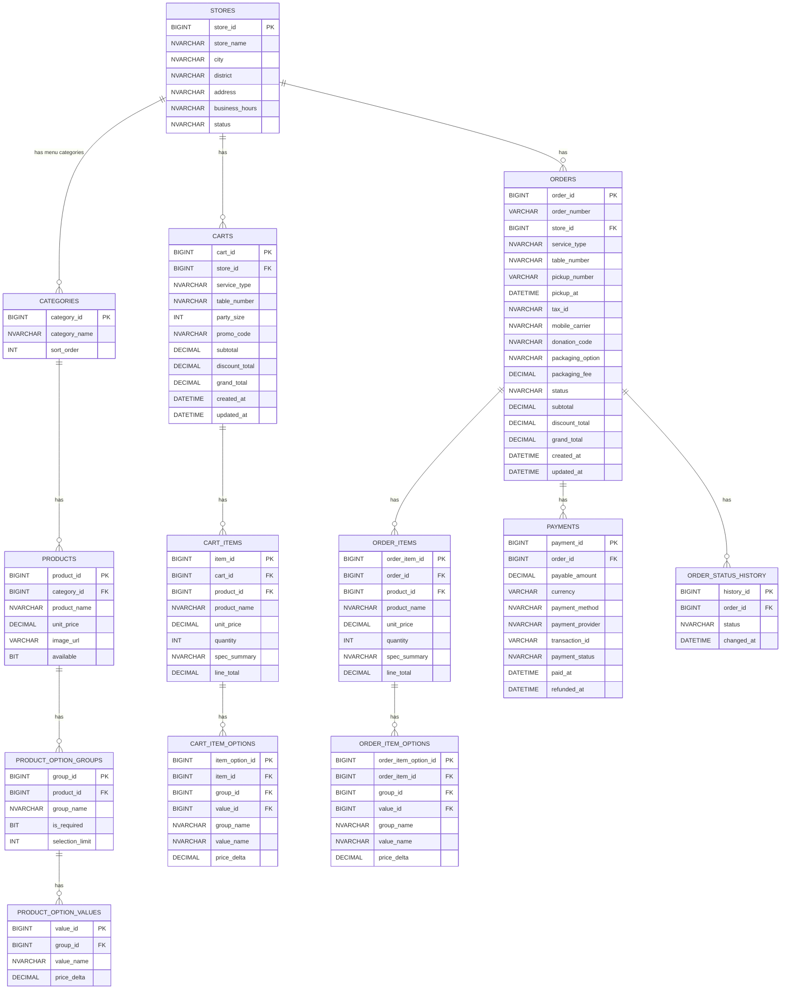

# 資料庫正規化：階段及程序

- 正規化：
  - 1NF 原子化；
  - 2NF 去部分相依；
  - 3NF 去傳遞相依；
  - BCNF 決定因子=鍵；
  - 4NF 去多值相依；
  - 5NF 去連接相依
- 程序：盤點鍵 → 拆表(1→3NF) → 設關聯/索引 

# 資料庫結構圖

# 資料庫結構規劃
列出資料表、欄位、中英名稱、型態、說明、索引鍵值

## 表 stores（門市）
  - store_id BIGINT PK：門市編號
  - store_name NVARCHAR(100)：門市名稱（INDEX）
  - city NVARCHAR(50)：縣市
  - district NVARCHAR(50)：行政區
  - address NVARCHAR(200)：地址
  - business_hours NVARCHAR(50)：營業時間
  - status ENUM('OPEN','BUSY','CLOSED')：門市狀態（INDEX）
  - 索引：(city, district)、status

## 表 categories（菜單分類）
  - category_id BIGINT PK：分類編號
  - category_name NVARCHAR(100)：分類名稱
  - sort_order INT：排序

## 表 products（商品）
  - product_id BIGINT PK：商品編號
  - category_id BIGINT FK→categories：分類編號（INDEX）
  - product_name NVARCHAR(100)：商品名稱（INDEX）
  - unit_price DECIMAL(10,2)：單價
  - image_url VARCHAR(255)：圖片網址
  - available BIT：是否可售（INDEX）

## 表 product_option_groups（商品選項群組）
  - group_id BIGINT PK：群組編號
  - product_id BIGINT FK→products：商品編號（INDEX）
  - group_name NVARCHAR(50)：群組名稱（如 尺寸/甜度）
  - is_required BIT：是否必填
  - selection_limit INT：可選上限

## 表 product_option_values（商品選項值）
  - value_id BIGINT PK：選項值編號
  - group_id BIGINT FK→product_option_groups：群組編號（INDEX）
  - value_name NVARCHAR(50)：選項值名稱（如 大杯/少冰）
  - price_delta DECIMAL(10,2)：價差

## 表 carts（購物車）
  - cart_id BIGINT PK：購物車編號
  - store_id BIGINT FK→stores：門市
  - service_type ENUM('TAKEOUT','DINE_IN')：用餐方式
  - table_number NVARCHAR(20) NULL：桌號（內用可填）
  - party_size INT NULL：人數
  - promo_code NVARCHAR(50) NULL：優惠碼
  - subtotal DECIMAL(10,2)：小計
  - discount_total DECIMAL(10,2)：折扣合計
  - grand_total DECIMAL(10,2)：應付總額
  - created_at DATETIME：建立時間
  - updated_at DATETIME：更新時間

## 表 cart_items（購物車明細）
  - item_id BIGINT PK：品項編號
  - cart_id BIGINT FK→carts：購物車（INDEX）
  - product_id BIGINT FK→products：商品
  - product_name NVARCHAR(100)：商品名稱
  - unit_price DECIMAL(10,2)：單價
  - quantity INT：數量
  - spec_summary NVARCHAR(200)：規格摘要
  - line_total DECIMAL(10,2)：小計

## 表 cart_item_options（購物車明細-選項）
  - item_option_id BIGINT PK：明細選項編號
  - item_id BIGINT FK→cart_items：明細（INDEX）
  - group_id BIGINT FK→product_option_groups：群組
  - value_id BIGINT FK→product_option_values：選項值
  - group_name NVARCHAR(50)：群組名稱
  - value_name NVARCHAR(50)：選項值名稱
  - price_delta DECIMAL(10,2)：價差

## 表 orders（訂單）
  - order_id BIGINT PK：訂單編號
  - order_number VARCHAR(30) UNIQUE：訂單號碼
  - store_id BIGINT FK→stores：門市（INDEX）
  - service_type ENUM('TAKEOUT','DINE_IN')：用餐方式
  - table_number NVARCHAR(20) NULL：桌號
  - pickup_number VARCHAR(20) UNIQUE：取貨號碼
  - pickup_at DATETIME NULL：取餐時間
  - tax_id NVARCHAR(10) NULL：統一編號
  - mobile_carrier NVARCHAR(20) NULL：手機載具
  - donation_code NVARCHAR(20) NULL：捐贈碼
  - packaging_option ENUM('NONE','CUTLERY','BAG_SMALL','BAG_MEDIUM','BAG_LARGE')：包裝選擇
  - packaging_fee DECIMAL(10,2)：包裝費用
  - status ENUM('RECEIVED','PREPARING','READY','PICKED_UP','CANCELLED')：訂單狀態（INDEX）
  - subtotal DECIMAL(10,2)：小計
  - discount_total DECIMAL(10,2)：折扣合計
  - grand_total DECIMAL(10,2)：應付總額
  - created_at DATETIME：建立時間
  - updated_at DATETIME：更新時間

## 表 order_items（訂單明細）
  - order_item_id BIGINT PK：訂單品項編號
  - order_id BIGINT FK→orders：訂單（INDEX）
  - product_id BIGINT FK→products：商品
  - product_name NVARCHAR(100)：商品名稱
  - unit_price DECIMAL(10,2)：單價
  - quantity INT：數量
  - spec_summary NVARCHAR(200)：規格摘要
  - line_total DECIMAL(10,2)：小計

## 表 order_item_options（訂單明細-選項）
  - order_item_option_id BIGINT PK：訂單明細選項編號
  - order_item_id BIGINT FK→order_items：訂單明細（INDEX）
  - group_id BIGINT FK→product_option_groups：群組
  - value_id BIGINT FK→product_option_values：選項值
  - group_name NVARCHAR(50)：群組名稱
  - value_name NVARCHAR(50)：選項值名稱
  - price_delta DECIMAL(10,2)：價差

## 表 payments（付款）
  - payment_id BIGINT PK：付款編號
  - order_id BIGINT FK→orders：訂單（INDEX）
  - payable_amount DECIMAL(10,2)：應付金額
  - currency VARCHAR(3)：幣別
  - payment_method ENUM('CASH','CARD','E_WALLET')：付款方式
  - payment_provider NVARCHAR(50) NULL：支付提供商
  - transaction_id VARCHAR(100) NULL UNIQUE：交易編號
  - payment_status ENUM('PENDING','AUTHORIZED','PAID','FAILED','REFUNDED')：付款狀態（INDEX）
  - paid_at DATETIME NULL：付款時間
  - refunded_at DATETIME NULL：退款時間

## 表 order_status_history（訂單狀態歷程，可選）
  - history_id BIGINT PK：歷程編號
  - order_id BIGINT FK→orders：訂單（INDEX）
  - status ENUM('RECEIVED','PREPARING','READY','PICKED_UP','CANCELLED')：狀態
  - changed_at DATETIME：變更時間