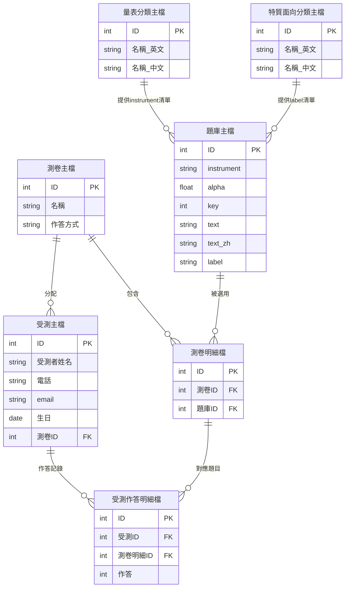
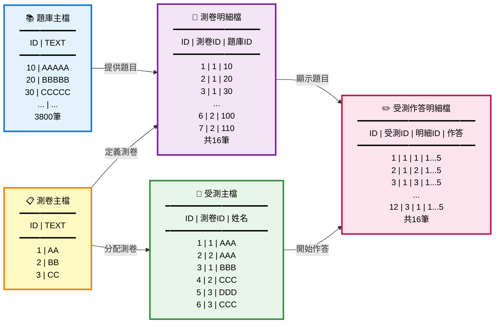

# 資料庫的規劃
- 定義資料表
- 定義欄位
- 定義主鍵(primary key: unique, not null.)
- 定義關聯

# 資料庫結構

## 題庫主檔
所有測卷題目的基本資料庫
目前約3800筆 
- instrument（量表名稱）
  - 關聯：量表分類主檔
- alpha（信度係數）
- key（計分方向）
- text（題目文字：英文）
- text_zh（題目文字：中文）
- label（特質面向）
  - 關聯：特質面向分類主檔

## 量表分類主檔
提供題庫主檔的量表名稱列表
(目前36個)
- ID
- 名稱(英文)
- 名稱(中文)

## 特質面向分類主檔
提供題庫主檔的特質面向名稱列表
(目前246個)
- ID
- 名稱(英文)
- 名稱(中文)

## 測卷主檔
有哪幾分測卷
(如:大五人格、MMPI、MBTI等三種)
- ID
- 名稱
- 作答方式(五點量表、六點量表...)
  - ❓細節待討論

## 測卷明細檔(題目)
每份測卷裡有哪些題目(題目來自題庫)
(如：三份測卷，各100題，共300題。)
- ID
- 測卷ID
- 題庫ID

## 受測主檔
每位受測者選取一份測卷，同一人受測兩次，暫視為兩次獨立受測。
- ID
- 受測者姓名
- 電話
- e-mail
- 生日
- 測卷ID
  - 關聯測卷主檔

## 受測作答明細檔
- ID
- 受測ID
- 測卷明細ID
- 作答

# 待進行事項
- 作答方式細部規劃
- 評分方式
- 產出報告架構
- 統計分析
---

# 使用者故事

## 故事 1：AAA 進行第一份測驗（大五人格）
**人物：** AAA（受測者）  
**目標：** 完成大五人格測驗，了解自己的人格特質

### 情境與流程：
1. **註冊並選擇測卷**
   - AAA 在系統中填寫基本資料（姓名、電話、email、生日）
   - 系統在「受測主檔」建立一筆記錄：`ID=1, 姓名=AAA, 測卷ID=1`（測卷 AA = 大五人格）
   
2. **開始答題**
   - 系統顯示測卷 AA 的五道題目（來自測卷明細檔 ID 1-5）
   - 題目來源：題庫主檔的題目 10, 20, 30, 40, 50
   - 作答方式：五點量表（1=非常不同意 ... 5=非常同意）
   
3. **記錄作答**
   - AAA 依序回答五題，系統在「受測作答明細檔」記錄：
     - ID=1, 受測ID=1, 測卷明細ID=1, 作答=1
     - ID=2, 受測ID=1, 測卷明細ID=2, 作答=1
     - ID=3, 受測ID=1, 測卷明細ID=3, 作答=1
     - ID=4, 受測ID=1, 測卷明細ID=4, 作答=1
     - ID=5, 受測ID=1, 測卷明細ID=5, 作答=1

4. **完成測驗**
   - 系統自動計算分數並產生報告
   - AAA 可查看結果報告

---

## 故事 2：AAA 進行第二份測驗（16PF）
**人物：** AAA（受測者）  
**目標：** 完成不同的測驗，深入了解自己

### 情境與流程：
1. **再次註冊**
   - AAA 又填寫一次資料，選擇測卷 BB（16PF）
   - 系統視為新受測記錄：`ID=2, 姓名=AAA, 測卷ID=2`（儘管與故事 1 是同一人）

2. **開始答題**
   - 測卷 BB 有六道題（測卷明細檔 ID 6-11）
   - 題目來源：題庫主檔的題目 100, 110, 120, 130, 140, 150
   - 作答方式：五點量表

3. **記錄作答**
   - AAA 完成六題，系統記錄：
     - ID=6~11, 受測ID=2, 測卷明細ID=6~11, 作答=1

4. **完成測驗**
   - 可與上次結果比較

---

## 故事 3：多人同時進行不同測驗
**人物：** BBB（另一位受測者）  
**目標：** 完成大五人格測驗

### 情境與流程：
1. **BBB 註冊並答題**
   - 受測主檔：`ID=3, 姓名=BBB, 測卷ID=1`（測卷 AA，與 AAA 同一份）
   - 系統顯示測卷 AA 的五道題
   - BBB 回答相同題目，但答案可能不同

2. **記錄作答**
   - 受測作答明細檔：ID=12~16, 受測ID=3, 測卷明細ID=1~5, 作答=1

3. **系統處理**
   - 不同受測者可用同一測卷，答案各自儲存
   - 系統可分析多人結果

---

## 重點摘要
- 同一人可以考多份測卷（AAA：AA → BB）
- 不同人可以考同一測卷（AAA 與 BBB 都考 AA）
- 每次受測視為獨立記錄，便於追蹤與統計
- 題目統一管理於題庫主檔，測卷由題目組合而成

---

# 資料庫 ER 圖

---

# 資料範例示意圖

